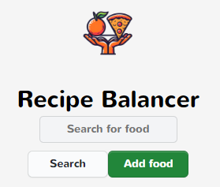
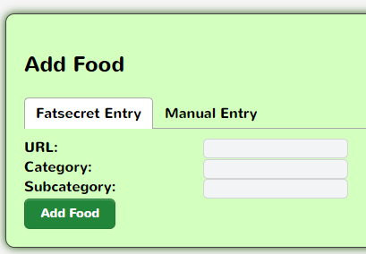
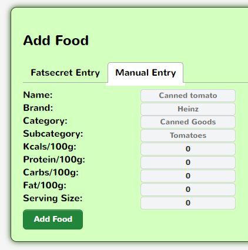
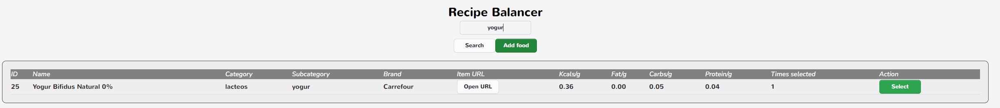
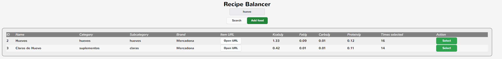
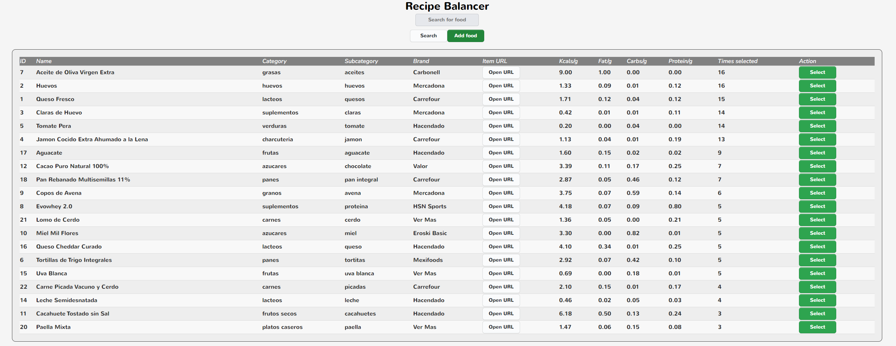
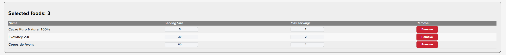
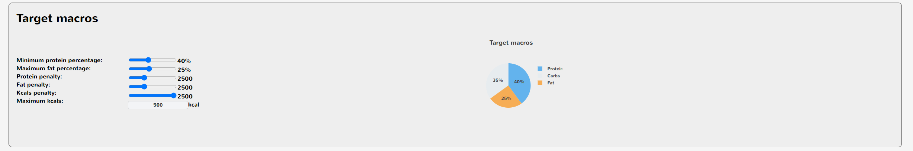
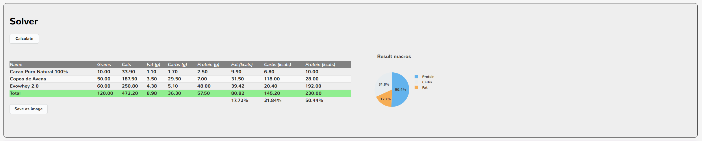
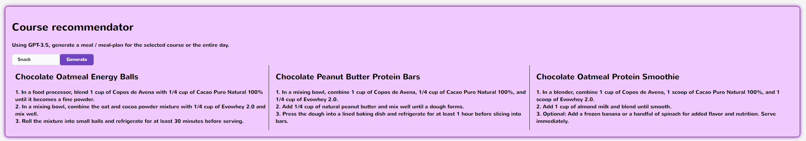

# Recipe Balancer

## The idea

Tired of weighting your ingredients on a scale and having to thing about the math behind it? This app will tell you how much of each ingredient you need to add to your recipe to reach the desired goal.

---

## The outcome

Given the next goals:

- Max kcals to consume
- Percentage goal of each macronutrient (protein, carbs, fat)
- Food list with:
  - Serving size (for example, a yogurt is 125g)
  - Max servings (for example 2 yogurts)

You will get:
- The amount of each food you need to eat to reach your goals
- The amount of each macronutrient you will consume
- The amount of kcals you will consume

Isn't that great? No more math trying to figure out how much of each ingredient you need to add to your recipe to reach your goals, and maximizing kcals and grams, so no more hunger!

---

## How to use it

### 1. Inserting a new food

In case there are no foods saved in the database, you will need to add them. To do so, click on the "Add food" button and fill the form with the food information. You will have two options:

- **FatSecret insertion**: Just paste the URL from the food in the FatSecret website and the app will fill the form for you. You will also have to insert a *category* and *subcategory*.

- **Manual insertion**: Fill the form manually.

### 2. Searching

Type what you want to search in the search bar and click on the "Search" button. You will get a list of foods that match your search. The results are ordered by the number of times the food has been used in recipes.

### 3. Adjusting the serving sizes

In this case, you will have to type the serving size per food and max number of servings per food. This comes usefull for example in calculating the foods in batches of 50g for meats if you want the meat to be in multiples of 50g; 100g for fruits, etc. There are cases where foods are "forced" to be in multiples of a certain number, like eggs that will always be in multiples of 55g, or 125g for yogurts.

In the other hand, if you want to skip this kind of constraint, you can set the serving size to 1 gram, and the max number of servings to the max grams of the food you want to consume. This will ease the calculations, but you will have to weight the food in a scale with great precision.

### 4. Setting the goals

You will have to set the goals for the recipe. The goals are presented in sliders for the macronutrients and in a text field for the kcals.

The system also uses "slack variables" for the constraints, so if you want to give some slack to the system, you can move the slack sliders to adjust the "constraining power" of the constraints.

### 5. Calculating

Click on the "Calculate" button and you will get the results. The results are presented in a table with the amount of each food you need to eat to reach your goals, the amount of each macronutrient you will consume and the amount of kcals you will consume.

You also have a Save button to download a snapshot of the results in a image.

### 6. Recipe recommendator with GPT

If you have an OpenAI API key, you can use the recipe recommendator. This will generate a recipe based on the foods you have in your database and the goals you have set. You can also set the number of recipes you want to generate.

---

## How to run it

#### Backend

Run `uvicorn main:app --reload` in the `balancer` folder.

#### Frontend
Run `npm start` in the `balancer-ui` folder.

#### DB

Run `docker-compose up db` in the root folder.

## How to deploy it

Just run `docker compose up` in the root folder.
